# 算法列表

  * 标准正态变换 MSC
  * 多元散射校正 SNV
  * Savitzky-Golay平滑滤波函数 SG
  * 滑动平均滤波 move_avg
  * 一阶差分 D1
  * 二阶差分 D2
  * 小波变换 wave
  * 均值中心化 mean_centralization
  * 标准化 standardlize
  * 最大最小归一化 max_min_normalization
  * 矢量归一化 vector_normalization

感谢 @[panxy0826](https://blog.csdn.net/Joseph__Lagrange/article/details/95302398)的开源，本Tool 部分搬运修改于该作者

# 快速使用

## 1. 导入数据

```python
# 导入 pandas 读取数据
import pandas as pd
import numpy as np

# 读取数据
data = pd.read_csv("./data/peach_spectra_brix.csv")

# m * n 
print("数据矩阵 data.shape：",data.shape)

# 50个样本， 600个 波段 第一列是 桃子糖度值 需要分离开
X = data.values[:,1:] 
```

## 2. 数据绘制

```python
from pretreatment import Pretreatment as pre
p = pre()

# 该方法为快速示例 而编写 
# 测试用例 图片名 波段起始点 波段间距
p.PlotSpectrum(X, '演示', 0, 5).show()
## 为保证数据可以正确绘制 请将 矩阵转化为 numpy.ndarray 格式
type(X)
```

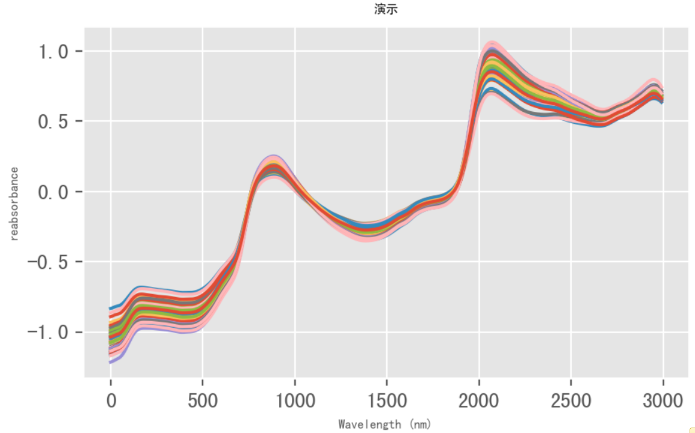

## 3. 数据预处理

### 标准正态变换 MSC

```python
msc = p.msc(X)
p.PlotSpectrum(msc, 'msc', 0, 5).show()
```

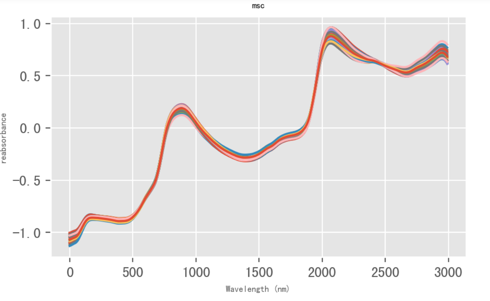

### 多元散射校正 SNV

```python
snv = p.snv(X)
p.PlotSpectrum(snv, 'snv', 0, 5).show()
```

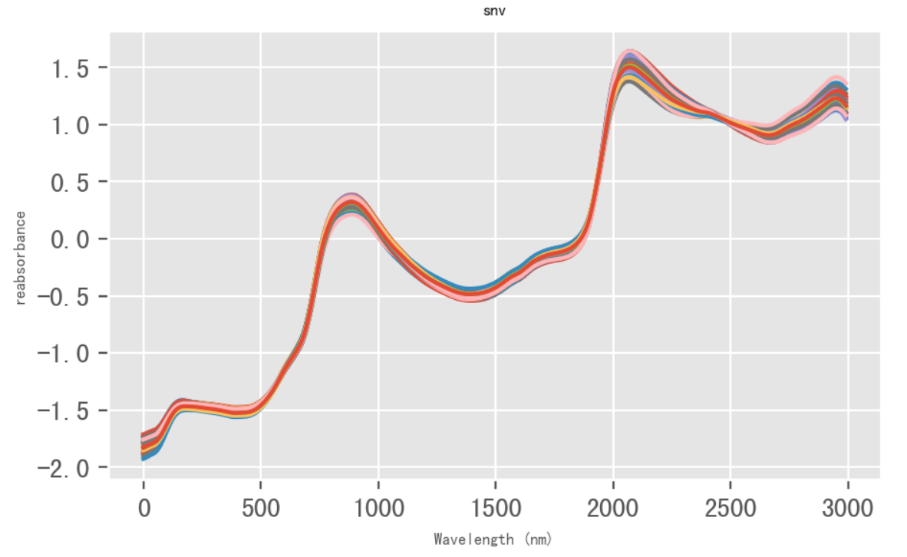

### Savitzky-Golay平滑滤波函数 SG

```python
# 此处参数为参考 具体 后续 详述
sg = p.SG(X, 4*5+1,2*3,2)
p.PlotSpectrum(sg, 'sg', 0, 5).show
```

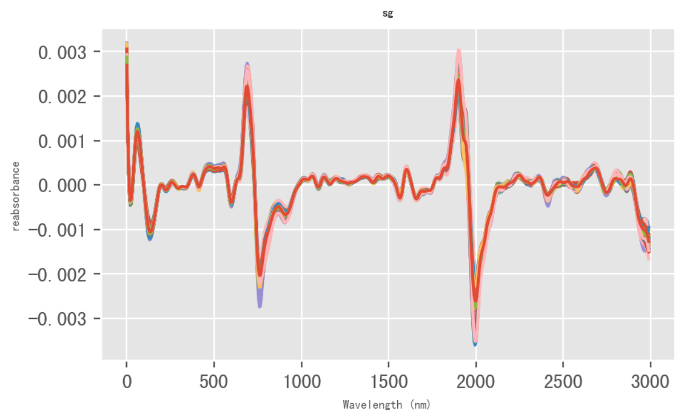

### 滑动平均滤波 move_avg

```python
move_avg = p.move_avg(X)
p.PlotSpectrum(move_avg, 'move_avg', 0, 5).show
```

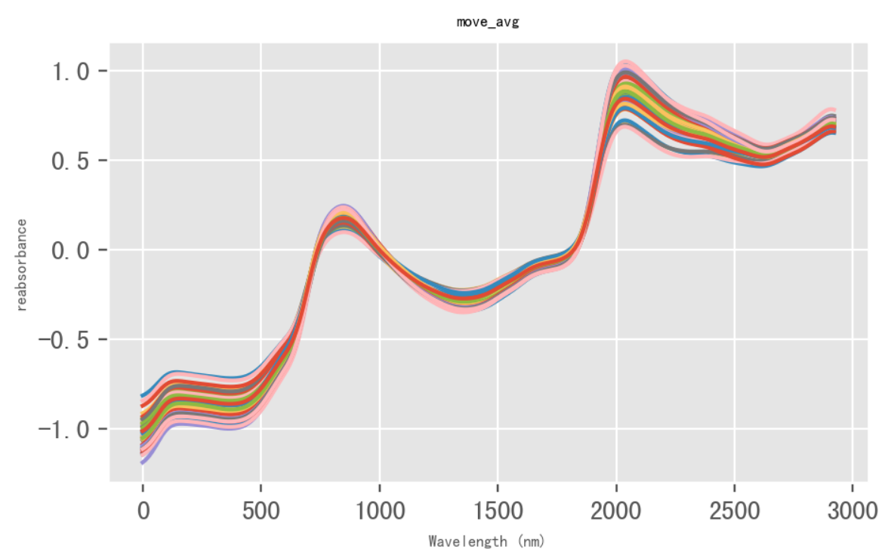

### 一阶差分 D1

```python
D1 = p.D1(X)
p.PlotSpectrum(D1, 'D1', 0, 5).show
```

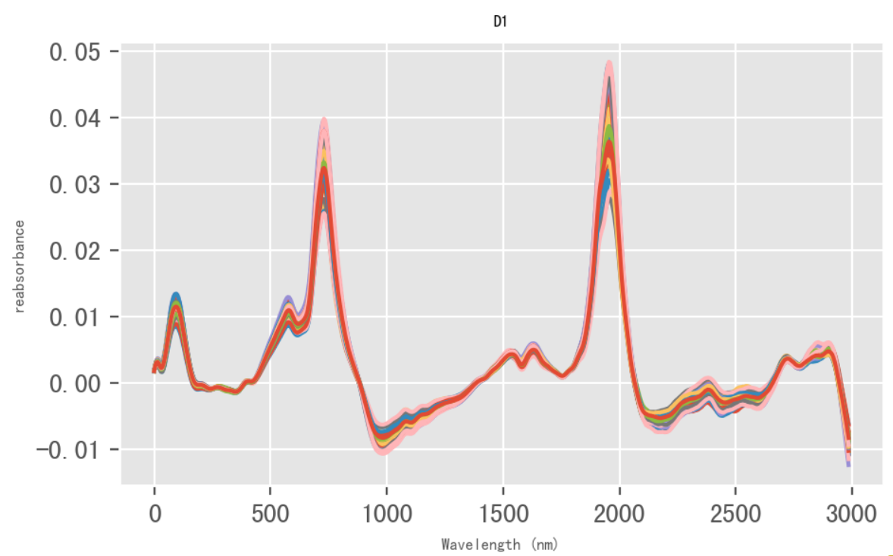

### 二阶差分 D2

```python
D2 = p.D2(X)
p.PlotSpectrum(D2, 'D2', 0, 5).show
```

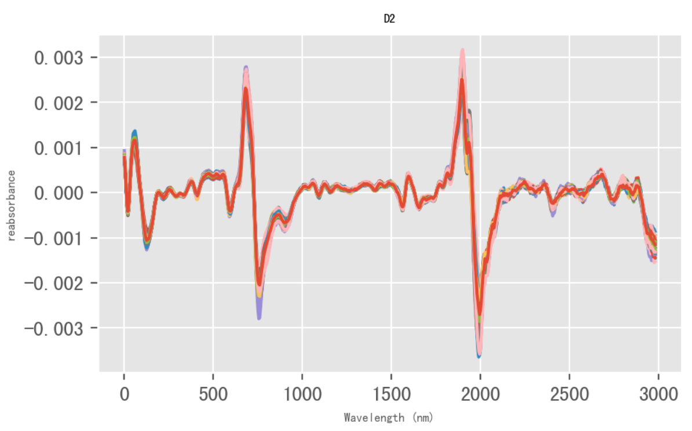

### 小波变换 wave

```python
wave = p.wave(X)
p.PlotSpectrum(wave, 'wave', 0, 5).show
```

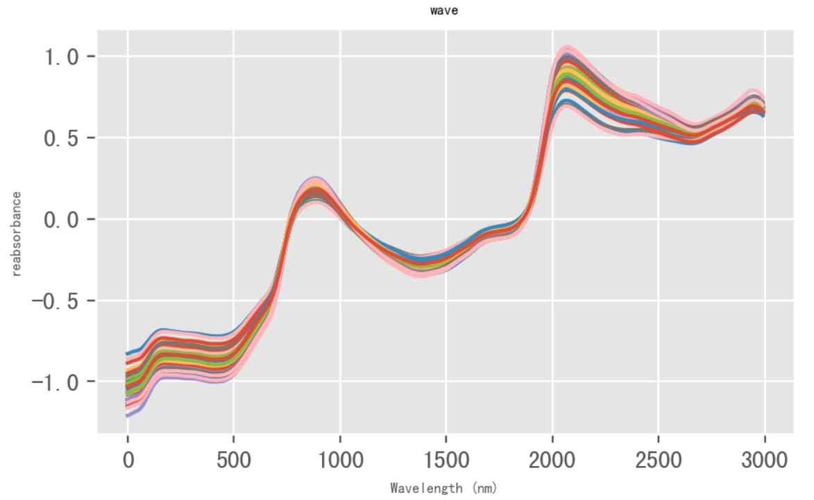

### 均值中心化 mean_centralization

```python
mean_centralization = p.mean_centralization(X)
p.PlotSpectrum(mean_centralization, 'mean_centralization', 0, 5).show
```

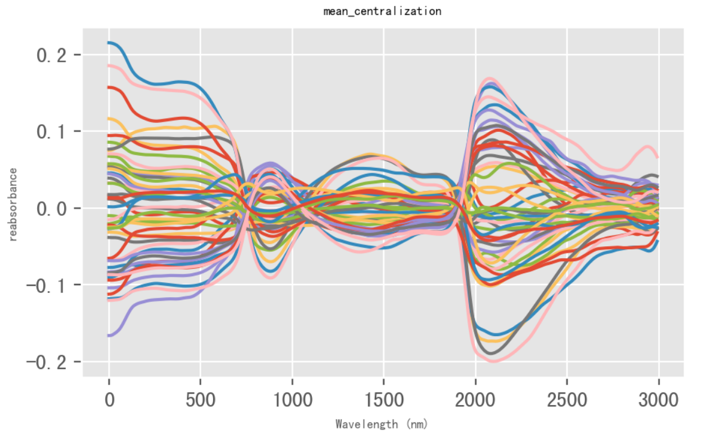

### 标准化 standardlize

```python
standardlize = p.standardlize(X)
p.PlotSpectrum(standardlize, 'standardlize', 0, 5).show
```

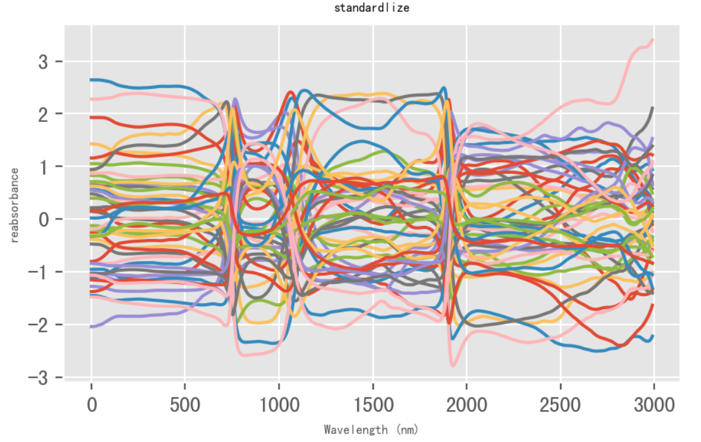

### 最大最小归一化 max_min_normalization

```python
max_min_normalization = p.max_min_normalization(X)
p.PlotSpectrum(max_min_normalization, 'max_min_normalization', 0, 5).show
```

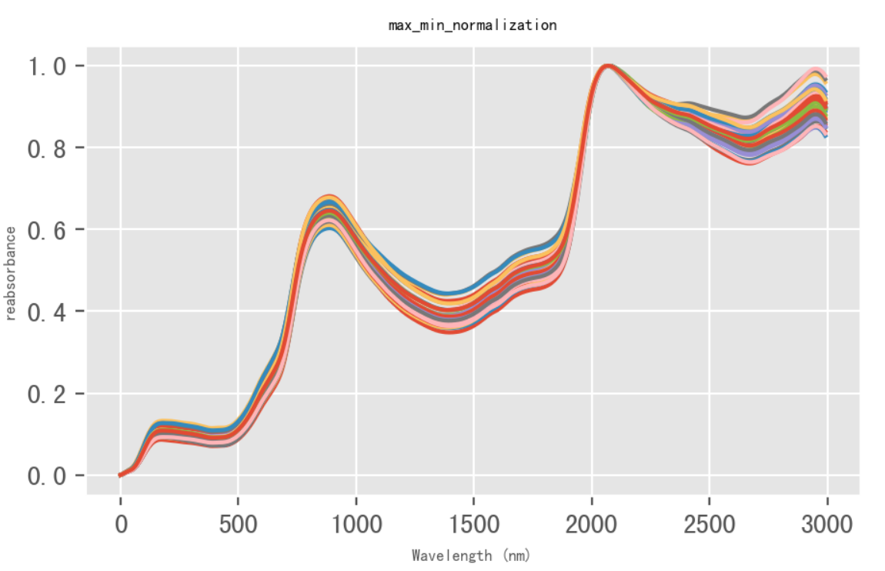

### 矢量归一化 vector_normalization

```python
vector_normalization = p.vector_normalization(X)
p.PlotSpectrum(vector_normalization, 'vector_normalization', 0, 5).show
```

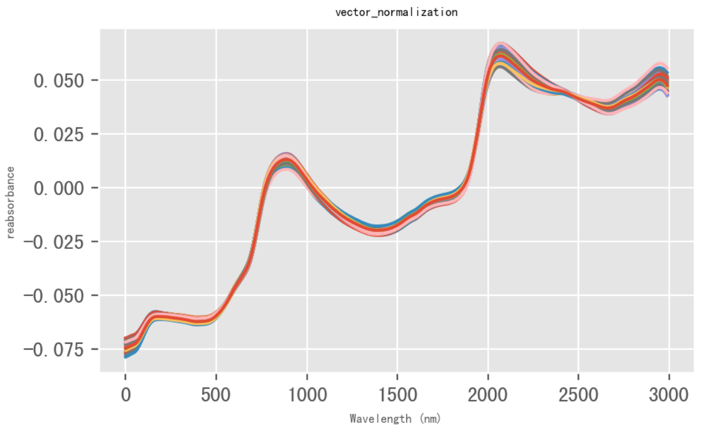

# 注意事项
示例数据来源：[nirpyresearch.com](https://nirpyresearch.com/)
源代码参考：https://gitee.com/aBugsLife/spectral-pretreatment-method
